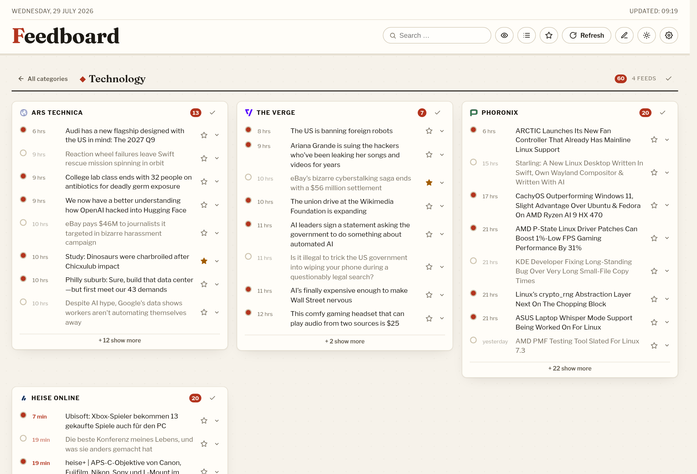
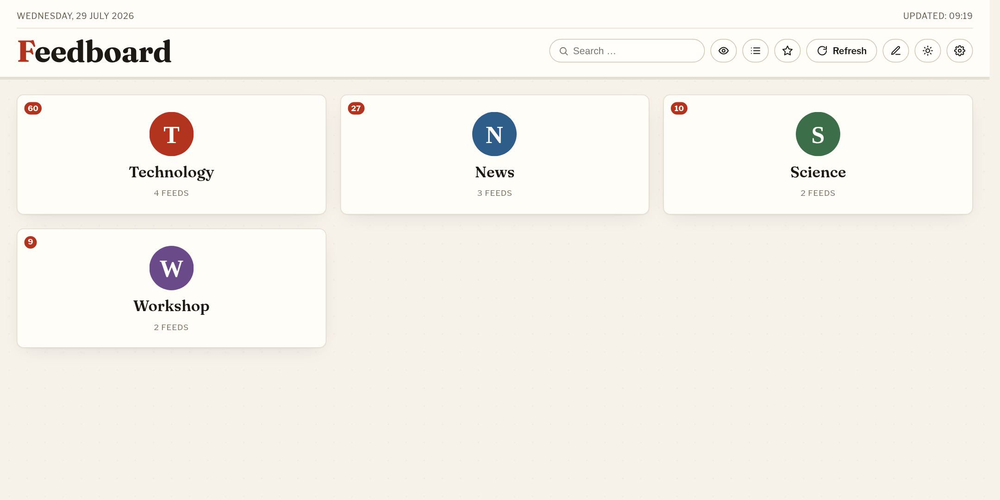
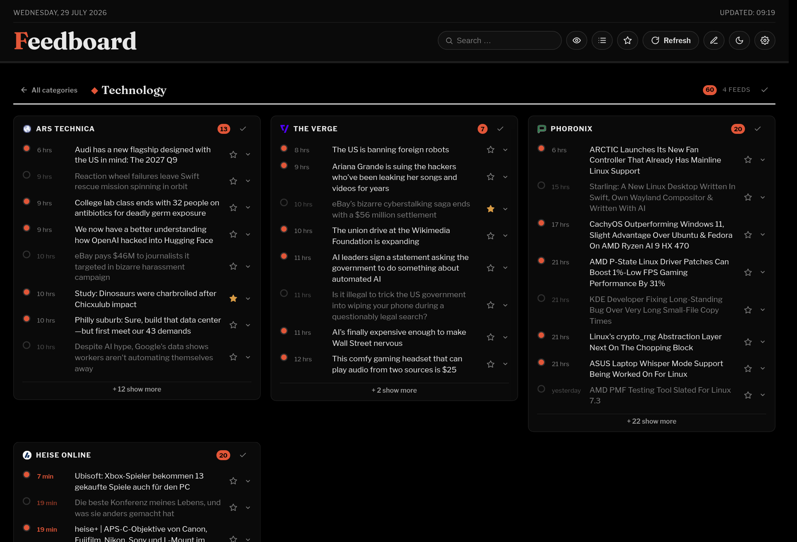
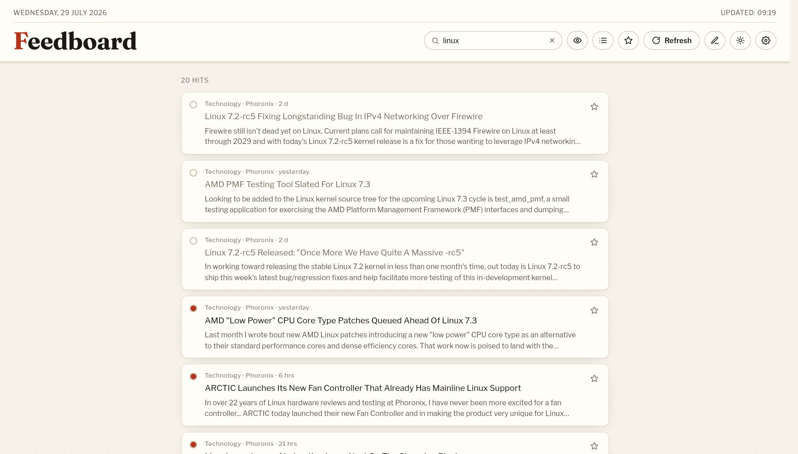
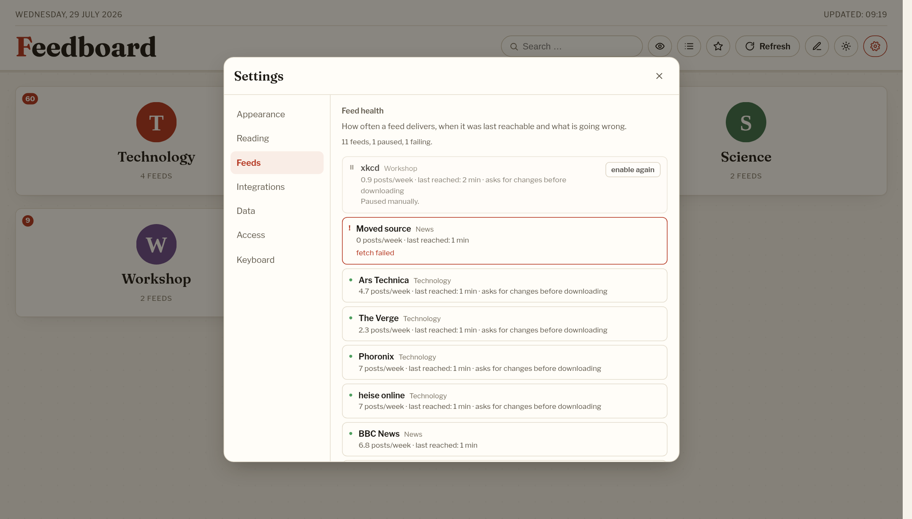
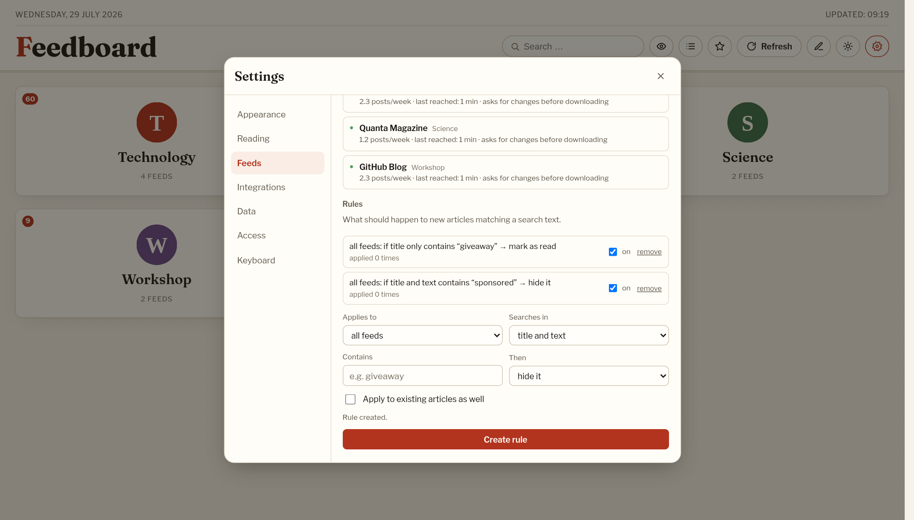
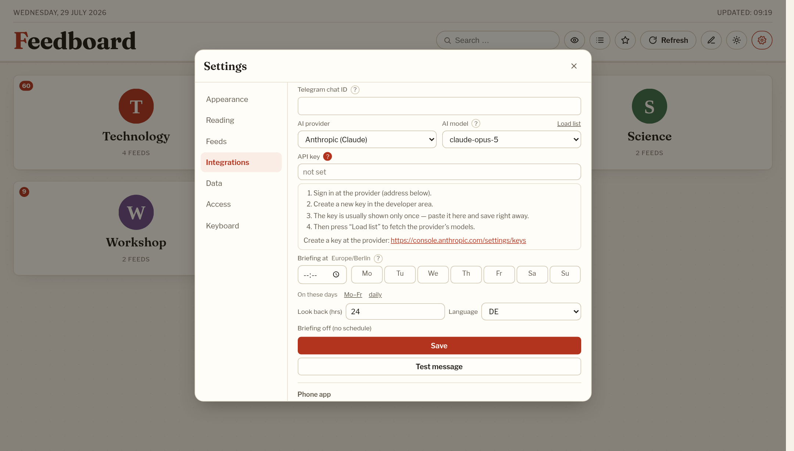
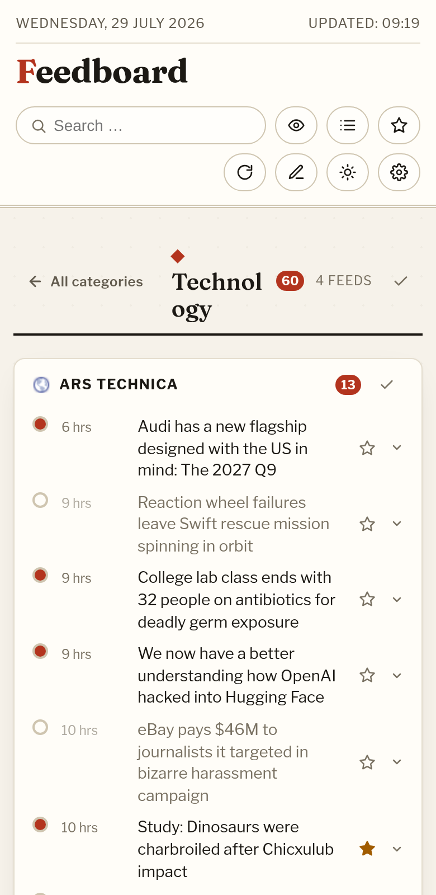

# Feedboard

*[Deutsche Fassung](README.md)*

Self-hosted dashboard for RSS/Atom feeds and public Telegram channels. Categories and sources are created, renamed, reordered and deleted entirely through the interface — no YAML configuration required.



## Views

<table>
<tr>
<td width="50%"><br><sub><b>Start page</b> — one tile per category, with an unread counter</sub></td>
<td width="50%"><br><sub><b>Dark theme</b> — OLED black, not dark grey</sub></td>
</tr>
<tr>
<td><br><sub><b>Search</b> — across title, summary, fetched full text and AI summary</sub></td>
<td><br><sub><b>Feed health</b> — frequency, last success, errors, auto-pause</sub></td>
</tr>
<tr>
<td><br><sub><b>Rules</b> — readable as a sentence, switchable one by one</sub></td>
<td><br><sub><b>Integrations</b> — AI provider, model, briefing schedule; the question mark unfolds instructions</sub></td>
</tr>
</table>

<p align="center">
  <br>
  <sub>On a phone as a PWA — the same interface, with a wrapping toolbar</sub>
</p>

## Features

### Managing sources

- **Categories & feeds fully managed in the UI** (edit mode via the pencil icon in the toolbar)
- **Feed autodiscovery**: enter a plain website address (e.g. `heise.de`) — the RSS/Atom feed is found automatically, and the name is taken from the feed if none is given
- **Public Telegram channels** as a source: enter `@channel` or `t.me/channel`; the public web preview is parsed
- **Category logos** can be uploaded (stored as image data in the database), and each category has its own anchor for the address bar
- Categories and feeds can be reordered freely
- **OPML import and export** from the settings window (section "Data") — the usual way in and out of other readers
- **Pause feeds**; a feed that fails 20 times in a row pauses itself and is no longer fetched (marked "paused" in the feed header)

### Reading

- **Home screen with category tiles**; clicking one opens the category with all its feeds (address `#/<anchor>`, so individual categories can be linked directly)
- **"All articles"**: one chronological river across every category (list icon in the toolbar, or press `a`)
- **Summaries** taken from the feed contents (HTML stripped), expandable by clicking the article row
- **Article preview** with image and summary on mouse hover; on touch devices as a slide-in card
- **Read state** per article, plus "mark all as read" per feed or category, unread counters and a filter for unread articles
- **Saved articles** (star) with a dedicated view
- **Full-text search** across all available articles — title, summary, fetched full text and AI summary
- **Hiding by keyword** (mute words); saved articles are never hidden
- **Fetch the full text** for feeds that only ship teasers: the article body is pulled from the page and stored in the database (readable offline too)
- **Keyboard navigation**: `j`/`k` move between articles, `o` open, `m` read, `s` save, `r` refresh, `u` unread only, `a` all articles, `/` search, `Esc` back (overview in the settings window)

### Optional: AI and sharing

Both stay switched off until they are set up — the buttons never even appear. Set them up in the settings window under "Integrations" (visible once signed in) or via environment variables.

- **AI summary** (three sentences) and **translation** per article via the configured AI provider (Anthropic, OpenAI, Google AI Studio, Groq, OpenRouter, Mistral, DeepSeek or your own OpenAI-compatible endpoint); both are cached, so each article costs at most one call
- **Daily briefing**: every unread article of the past 24 hours grouped by topic (settings window, section "Integrations"); reused for six hours
- **Share an article via Telegram** — to your own chat through a bot
- **Scheduled briefing via Telegram**: pick a time and the weekdays in the settings window, Feedboard does the rest. The time applies in the server's time zone, which is shown next to the field
- **Rules**: "title contains X → mark as read, star it or hide it", per feed or for all. Optionally applied to existing articles right away
- **Feed health** in the settings window: how often a feed delivers, when it was last reachable, what is going wrong — plus a button for feeds that paused themselves after too many errors
- **Conditional fetching**: Feedboard remembers each feed's ETag and Last-Modified and only asks for changes next time. 27 % less traffic in the measurement
- **Full-text search** through a SQLite index (FTS5, trigram tokenizer): substring search as before, but 5 to 23 times faster, title matches first
- **Read offline**: saved and unread articles can be stashed in the browser together with their text
- **Set-up in the window**: bot token, chat ID, AI provider with key and model, and the briefing (time and weekdays) can be set under "Integrations" once signed in, including a button for a test message. A question mark next to each field unfolds short instructions — for the API key with the address of the currently selected provider. The secrets never leave the server again — only their last four characters are shown

### Security & backup

- **Reading stays open for everyone, editing is protected.** Once a password is set, only interventions require a login: creating, changing, reordering and deleting categories and feeds, OPML import, restore, mute words, downloading a backup — plus anything that costs money or goes outward (AI calls, sharing). Board, search, read state and stars stay open.
- Clicking the pencil then opens a **login dialog** instead of edit mode, and continues straight into it afterwards. A signed cookie keeps you logged in for 30 days. Ten failed attempts per quarter hour and source IP is the limit.
- **Set and change the password in the settings window** under "Access". It is stored as an scrypt hash in the database; `FEEDBOARD_PASSWORD` creates the first one on the very first start. Changing it logs every other session out.
- With no password set everything stays open as before — an update changes nothing for existing installations.
- **JSON backup** to download and restore (categories, feeds, articles, settings). Credentials are deliberately left out and survive a restore. Restoring replaces the rest and runs in a transaction — if it fails, the old database is left untouched.

### Appearance & operation

- **Settings as a window** with the sections Appearance, Reading, Integrations, Data, Access and Keyboard; full screen on phones
- **Theme: light, dark or system** — selectable in the settings window; "system" follows the operating system setting and switches along with it while running. The sun/moon button remains as a quick light/dark toggle
- **Display settings**: font size, row density, thumbnails in the list, and favicons optionally served from the local cache (no calls to external services while browsing)
- **Merge duplicate stories**: in "All articles", the same story from several sources is bundled into one entry; the other sources are listed underneath and stay individually clickable. Can be turned off in the settings window
- **Trilingual interface** (German, English, Russian) — the browser language is picked up on the first visit, after that the choice in the settings window applies. Server messages are translated too
- **Installable as a PWA**; the app shell and the most recently loaded data are available offline
- **Automatic background refresh** (default: every 30 minutes) plus manual refresh, for a single feed or all of them
- Per-feed error display (⚠ with details). 30 read articles are kept per feed; unread and saved ones stay (hard cap at 300 per feed)
- SQLite via the **built-in `node:sqlite`** — no native dependencies, no compiling (ideal for a Raspberry Pi)

## Requirements

- **Node.js 22.5 or newer** (because of `node:sqlite`); the `ExperimentalWarning: SQLite` message at startup is normal and harmless
- Alternatively: Docker (the image ships with Node 22)

## Getting started (local)

```bash
npm install
npm start
```

Then open `http://localhost:8321` in the browser.

On the very first start, example categories are created (heise, Golem, tagesschau) — they can be deleted or replaced in edit mode.

## Getting started (Docker / Raspberry Pi)

```bash
docker compose up -d --build
```

The database lives in the `./data` folder and survives container restarts and updates.

## Phone apps (Fever API)

Feedboard speaks the Fever protocol, understood by NetNewsWire, Reeder, FeedMe and Fluent Reader. Set it up in the settings window under "Integrations": a user name and a word of your own — **not** the Feedboard password. Only the md5 value the app sends anyway is stored.

In the app, add an account of type "Fever" and use `https://your-address/fever`. Read and saved states then sync in both directions.

## Configuration (environment variables)

Telegram, the AI provider with its key and the briefing schedule can also be set **in the settings window under "Integrations"** — visible once you are signed in. The environment variables seed these values on the very first start; after that the settings window wins (the same behaviour as `FEEDBOARD_PASSWORD`). Starting with no environment variables at all works fine — set everything up in the settings window.

| Variable                 | Default               | Meaning                                                                                                     |
| ------------------------ | --------------------- | ----------------------------------------------------------------------------------------------------------- |
| `PORT`                   | `8321`                | HTTP port                                                                                                     |
| `FETCH_INTERVAL_MINUTES` | `30`                  | Refresh interval in minutes (5–59)                                                                            |
| `DB_PATH`                | `./data/feedboard.db` | Path to the SQLite file                                                                                       |
| `DEV_ASSETS`             | –                     | `1` = determine the asset version from file timestamps on every page request (for live frontend development)   |
| `FEEDBOARD_PASSWORD`     | –                     | Creates the password on the very first start. Afterwards the one set in the menu applies. Empty = editing stays open. |
| `AI_PROVIDER`            | `anthropic`           | AI provider: `anthropic`, `openai`, `google` (AI Studio), `groq`, `openrouter`, `mistral`, `deepseek` or `custom`         |
| `AI_MODEL`               | per provider          | Seed value for the model. The settings window can fetch the list from the provider                                       |
| `AI_BASE_URL`            | –                     | Only with `AI_PROVIDER=custom`: OpenAI-compatible endpoint, e.g. Ollama or LM Studio on your own network                  |
| `ANTHROPIC_API_KEY` etc. | –                     | Seed value for that provider's key — also `OPENAI_API_KEY`, `GOOGLE_AI_API_KEY`, `GROQ_API_KEY`, `OPENROUTER_API_KEY`, `MISTRAL_API_KEY`, `DEEPSEEK_API_KEY` |
| `TELEGRAM_BOT_TOKEN`     | –                     | Seed value for the bot token (with `TELEGRAM_CHAT_ID`). Afterwards the settings window applies                                             |
| `TELEGRAM_CHAT_ID`       | –                     | Seed value for the target chat. Afterwards the settings window applies                                                                               |
| `BRIEFING_TIME`          | –                     | Seed value for the briefing time, e.g. `07:30` (per `TZ`). Empty = off. Needs AI and Telegram                             |
| `BRIEFING_DAYS`          | daily                 | Weekdays for the briefing, `0` = Sunday … `6` = Saturday, e.g. `1,2,3,4,5`                                                |
| `BRIEFING_LANG`          | `de`                  | Seed value for the briefing language (`de`, `en`, `ru`). Afterwards the settings window applies                                                         |
| `BRIEFING_HOURS`         | `24`                  | Seed value for the briefing look-back in hours (1–168). Afterwards the settings window applies                                                    |

For Docker, the optional values are best kept in a `.env` next to `docker-compose.yml` — they are already passed through there.

## API (in case you want to use it directly)

### Board & metrics

| Method & path     | Purpose                                                                                                          |
| ----------------- | ---------------------------------------------------------------------------------------------------------------- |
| `GET /api/board`  | The whole board (categories → feeds → articles)                                                                   |
| `GET /api/stats`  | Lightweight metrics for external dashboards: unread, categories, feeds, failing feeds, articles, saved, last fetch |

### Categories

| Method & path                     | Purpose                                        |
| --------------------------------- | ---------------------------------------------- |
| `POST /api/categories`            | Create a category `{ name, slug? }`            |
| `PATCH /api/categories/:id`       | Rename a category `{ name, slug? }`            |
| `PUT /api/categories/:id/logo`    | Set the logo `{ logo }` (image as a data: URI) |
| `DELETE /api/categories/:id/logo` | Remove the logo                                |
| `DELETE /api/categories/:id`      | Delete a category with its feeds and articles  |
| `POST /api/categories/reorder`    | Set the order `{ ids: [3,1,2] }`               |

### Feeds

| Method & path                 | Purpose                                                                            |
| ----------------------------- | ---------------------------------------------------------------------------------- |
| `POST /api/feeds`             | Create a feed `{ category_id, url, name? }` (website address, RSS address or Telegram channel) |
| `PATCH /api/feeds/:id`        | Rename or pause a feed `{ name?, enabled? }`                                       |
| `DELETE /api/feeds/:id`       | Delete a feed                                                                      |
| `POST /api/feeds/reorder`     | Set the feed order `{ ids: […] }`                                                  |
| `POST /api/feeds/:id/refresh` | Refresh a single feed immediately                                                  |
| `POST /api/refresh`           | Refresh all feeds immediately                                                      |

### Reading, saving, searching

| Method & path                   | Purpose                                                |
| ------------------------------- | ------------------------------------------------------ |
| `POST /api/articles/:id/read`   | Mark an article read/unread `{ read }`                 |
| `POST /api/feeds/:id/read`      | Mark all articles of a feed as read                    |
| `POST /api/categories/:id/read` | Mark all articles of a category as read                |
| `POST /api/articles/:id/star`   | Save/unsave an article `{ starred }`                   |
| `GET /api/saved`                | Saved articles (max. 200)                              |
| `GET /api/search?q=…`           | Full-text search across all articles (max. 100 hits)   |
| `GET /api/settings/mute`        | Read the mute words                                    |
| `PUT /api/settings/mute`        | Set the mute words `{ words: […] }`                    |
| `GET /api/settings/integrations` | Read integrations (signed in only; no secrets)        |
| `PUT /api/settings/integrations` | Set integrations (signed in only; omitted fields stay) |
| `POST /api/settings/integrations/test-telegram` | Send a test message (signed in only)  |
| `PUT /api/settings/fever` | Set or remove the phone-app access (signed in only) |
| `ALL /fever` | Fever API for phone apps (own key, no cookie) |
| `GET /api/feeds/health` | State of every feed: frequency, last success, errors, auto-pause |
| `GET /api/rules` | Read rules |
| `POST /api/rules` | Create a rule, optionally applied retroactively (signed in only) |
| `PATCH /api/rules/:id` | Enable or disable a rule (signed in only) |
| `DELETE /api/rules/:id` | Delete a rule (signed in only) |
| `GET /api/offline/list` | IDs for the offline stash |
| `GET /api/settings/ai-models` | Fetch the model list from the configured provider (signed in only) |
| `GET /api/favicon?host=…`       | Serve a favicon from the local cache                   |

### Full text, AI and sharing

| Method & path                           | Purpose                                                              |
| --------------------------------------- | -------------------------------------------------------------------- |
| `GET /api/articles/:id/content`         | Read the already fetched full text                                   |
| `POST /api/articles/:id/content`        | Fetch the full text from the article page and store it `{ force? }`   |
| `POST /api/articles/:id/ai/summary`     | Generate an AI summary (cached) `{ force? }`                          |
| `POST /api/articles/:id/ai/translate`   | Translate an article `{ lang: 'de' \| 'ru' \| 'en', force? }`         |
| `POST /api/ai/briefing`                 | Daily briefing over the unread articles `{ lang?, hours?, force? }`   |
| `POST /api/articles/:id/share/telegram` | Send an article to your own Telegram chat                             |

### Migration, backup and login

| Method & path       | Purpose                                                       |
| ------------------- | ------------------------------------------------------------- |
| `GET /api/opml`     | Download all categories and feeds as OPML                     |
| `POST /api/opml`    | Import OPML `{ xml }` (existing feeds are skipped)             |
| `GET /api/backup`   | Complete backup as JSON                                       |
| `POST /api/restore` | Restore a backup (replaces everything)                        |
| `POST /api/login`   | Log in `{ password }` — sets the session cookie                |
| `POST /api/logout`  | Log out                                                       |
| `POST /api/password`| Set or change the password `{ current, next }`                 |

## Development

`smoke-test.js` checks the frontend (rendering, category drill-down, edit mode, theme selection, XSS escaping, "all articles", keyboard navigation, article actions, feed pausing) without a browser. Run `npm install --no-save jsdom` once, then `node smoke-test.js`.

**Forgot the password?** Clear the hash once, then `FEEDBOARD_PASSWORD` applies again on the next start:

```bash
docker compose exec feedboard node -e "require('./db').setSetting('password_hash', null)"
docker compose restart
```

**Changing the frontend without a rebuild:** `docker-compose.yml` mounts `./public` into the container read-only and sets `DEV_ASSETS=1`. Changes to HTML, CSS and JavaScript are then visible after a reload in the browser. Backend changes (`server.js`, `db.js`, `feedFetcher.js`, `telegram.js`, `opml.js`, `extract.js`, `auth.js`, `ai.js`) live in the image and require `docker compose up -d --build`. For plain production use, the mounted line and `DEV_ASSETS` can be removed from `docker-compose.yml`.

## Project layout

```
server.js        Express server, API, cron job
db.js            SQLite schema and data access (node:sqlite), backup
feedFetcher.js   RSS/Atom parsing, summaries, autodiscovery
telegram.js      Reading public Telegram channels, sharing articles via a bot
opml.js          Reading and writing OPML
extract.js       Full text from article pages (own heuristic on cheerio)
auth.js          Password (scrypt), session cookie, per-route protection
ai.js            AI providers: summary, translation, briefing
fever.js         Fever API for phone apps
config.js        Integrations in the database (Telegram, AI, briefing), seeded from the environment
errors.js        Errors carrying a translation key
public/providers.js  List of AI providers (shared by server and UI)
public/schedule.js   Briefing schedule: time and weekdays
public/          Frontend (HTML/CSS/JS, no framework, PWA) incl. login.html
data/            SQLite database and favicon cache (created automatically)
```
